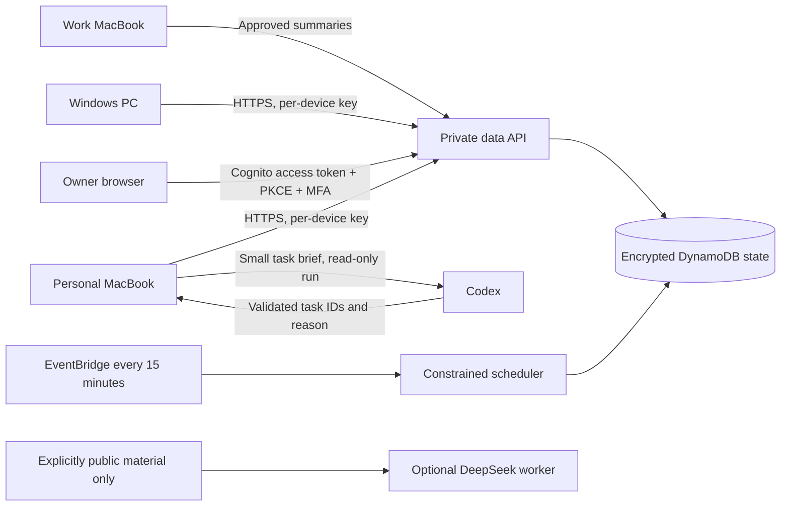

# Clara architecture

The open repository contains code, synthetic tests, connector contracts and infrastructure. It contains no owner email, account IDs, mail, financial records, local activity, production URLs, credentials or real task seed data.

## Runtime boundaries

The HTTP API exposes a public, generic sign-in shell. No private content is embedded in that shell or static bundle. Data routes require a verified Cognito access token and an exact immutable owner `sub`. Self-registration is disabled. TOTP MFA is required. API Gateway validates token signatures, issuer, audience and scope. The application also checks the owner subject and `token_use`. Device tokens are a separate, revocable authentication boundary: evidence upload only by default; optional planning access exposes only bounded task briefs, not raw evidence or financial data.

Local preview binds to loopback, checks Host and Origin, exchanges a single-use URL fragment for an HttpOnly SameSite=Strict cookie and persists outside source. Local data relies on OS permissions and disk encryption; it is not application-encrypted. AWS uses encrypted DynamoDB with point-in-time recovery. Artifact S3 buckets block public access, encrypt objects and deny non-TLS access. Logs contain status and error classes, not request bodies.

## Packages

- `apps/web`: React + TypeScript working interface. No third-party analytics, remote fonts or images.
- `apps/api`: Python domain rules, storage, authorization, API and scheduled planning.
- `clara_agent`: macOS/Windows metadata collectors, credential-manager integration, Codex ranker and optional public-only DeepSeek worker.
- `apps/chrome`: optional explicit page-brief capture extension for approved work origins. This version is manual, not unattended scraping.
- `infra`: AWS CloudFormation deployment with separate resources.
- `tests`: deterministic tests for security and scheduling invariants, using synthetic records only.

## Planning and evidence

Task priorities are editable. Imminent deadlines, model ranking and explicit priority feed a constrained scheduler. A day has bounded priorities, focus-session limits and buffers. Lower energy reduces the plan. Meetings retain fixed time; preparation is placed beforehand, with conflicts surfaced. The scheduler never invents meeting facts. Locked, started, completed and set-aside blocks survive replanning. Long-term views hold outcomes; they are not fabricated hour-by-hour calendars.

Codex returns only existing task IDs and a short reason. Its adapter runs in a temporary working directory with read-only sandbox, ignored user configuration, no web search, disabled shell tools and a structured output schema. Results cannot complete tasks, send messages or move appointments. Invalid or stale proposals are discarded. Hourly proposal limits and an eight-proposal daily limit apply per owner state. A failed model call retains the previous plan. The cloud scheduler currently uses the latest accepted ranking; a nominated, awake laptop runs Codex. It is not an always-on cloud Codex runtime.

Collectors record observed timestamps and stable IDs. Repeated ingestion deduplicates. Observations remain unreviewed until the owner confirms or dismisses them. A file modification, open tab, thread update, elapsed timer or email never proves task completion. Focus-session completion and task completion are different explicit owner actions.

## Multi-device consistency

State updates use optimistic revisions with an atomic compare-and-swap. Stale edits receive HTTP 409. The web client refreshes instead of overwriting another device's work. Device records include last-seen times and revocation. One cycle takes a local lock; OS scheduling does not start overlapping Codex runs. Offline data is recollected from a bounded seven-day window on reconnection; there is no full offline mutation queue yet.

## Privacy and control

Pause prevents new cloud planning and stops the companion before it reads sources. It does not erase previously stored data. Evidence is pruned to 30 days during ingestion and capped at 300 records. The audit is capped at 100 entries. Plans and tasks persist until edited or exported; full account deletion requires the documented administrator teardown. DynamoDB backup retention means deleting live evidence does not immediately delete historical backup copies. A restore must reapply the user's deletion requests before use.

No bank credentials, screenshots, keystrokes, conversation bodies or arbitrary file contents are collected. The current Gmail adapter reads metadata only, requires its own OAuth consent and excludes likely authentication mail. Private data does not go to DeepSeek: its adapter requires explicitly public classification. Workplace data must follow employer rules; the extension has no preconfigured workplace origins and does not grant itself access.

## Current limits

This is an early single-owner deployment, not a mature health or financial product. State is a single DynamoDB item limited by the application to 330 KB, deliberately bounding early scope. Split into separately encrypted records before scaling beyond that. CSV bank imports, regulated Open Banking onboarding, Gmail OAuth setup UI, automatic meeting-brief extraction, task-to-goal relationships, background work-page capture, device offline queues, full deletion workflow, refresh-token rotation and a cloud-hosted Codex worker remain separate modules to complete. The front end asks for sign-in again after access-token expiry.
